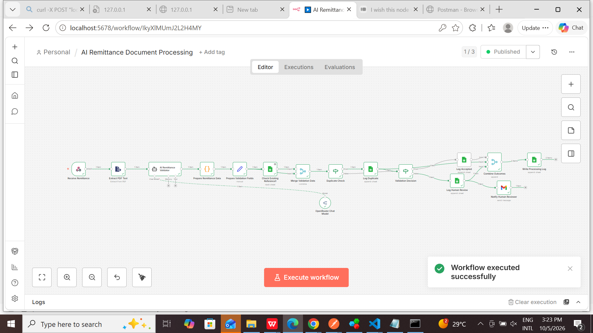
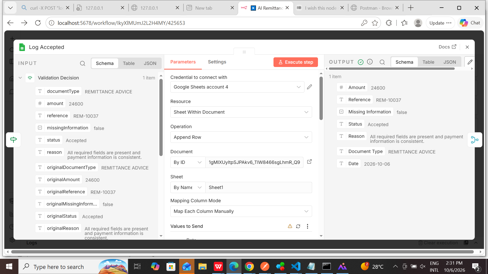
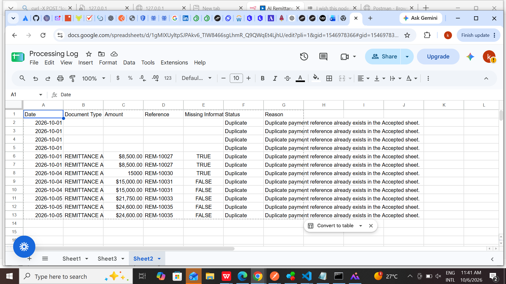
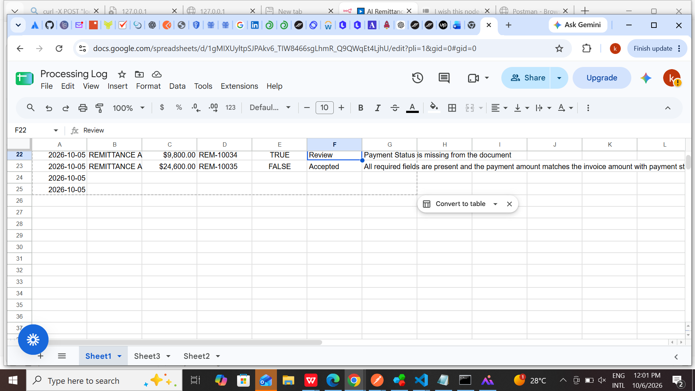
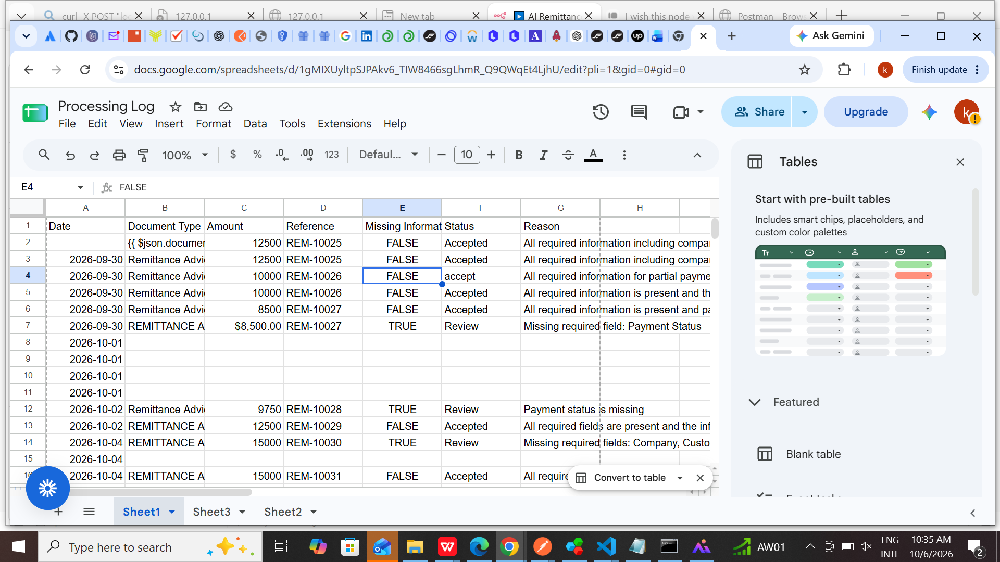
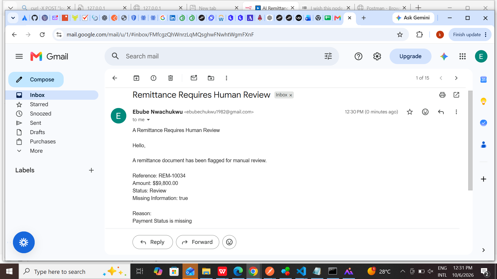
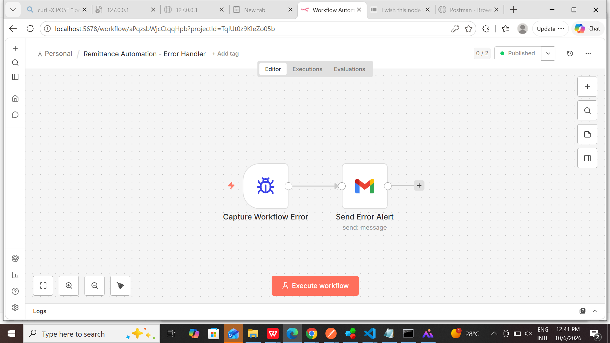

# AI-Powered Remittance Document Processing Automation

## Overview

An n8n-based automation that processes remittance PDF documents, extracts payment information, uses AI to validate the data, detects duplicate payment references, routes incomplete documents for human review, logs processing results, and sends automated email notifications.

## Business Problem

Manual remittance processing can be time-consuming and prone to errors.

Organizations receiving large numbers of remittance documents need a reliable way to:

- Extract information from incoming documents
- Validate payment information
- Detect duplicate payment references
- Identify incomplete documents
- Route exceptions to human reviewers
- Maintain an audit trail
- Alert users when automation errors occur

## Solution

This project automates the remittance processing workflow using n8n.

The workflow:

1. Receives a remittance PDF through a webhook
2. Extracts text from the PDF
3. Uses an AI agent to validate the remittance information
4. Prepares the extracted data
5. Checks whether the payment reference already exists
6. Detects duplicate references
7. Validates whether required information is present
8. Routes the document into three possible outcomes:
   - Accepted
   - Duplicate
   - Human Review
9. Logs the processing result
10. Sends an email notification when human review is required
11. Uses a separate error-handling workflow to notify when the automation fails

## Workflow Architecture

```text
Receive Remittance
        ↓
Extract PDF Text
        ↓
AI Remittance Validator
        ↓
Prepare Remittance Data
        ↓
Prepare Validation Fields
        ↓
Check Existing Reference
        ↓
Merge Validation Data
        ↓
Duplicate Check
     ↙       ↘
Duplicate   Not Duplicate
    ↓            ↓
Log Duplicate  Validation Decision
                    ↙        ↘
              Accepted      Human Review
                 ↓              ↓
           Log Accepted   Log Human Review
                                ↓
                     Notify Human Reviewer

Accepted / Duplicate / Human Review
                ↓
        Combine Outcomes
                ↓
       Write Processing Log


Key Features
1. PDF Remittance Intake
The workflow receives remittance documents through a webhook.
The incoming document is then processed automatically without requiring manual data entry.
2. PDF Text Extraction
The remittance PDF is processed and its text content is extracted for further analysis.
3. AI-Powered Validation
An AI agent analyzes the extracted remittance information and validates the payment data.
The AI-assisted validation process helps identify required information and potential issues in the document.
4. Duplicate Detection
The workflow checks whether the payment reference already exists before processing the remittance.
If the reference already exists, the remittance is classified as:
Duplicate
This helps prevent duplicate processing of the same payment.
5. Human-in-the-Loop Review
If required information is missing, the workflow routes the remittance to a human review process.
The reviewer receives an automated email containing information such as:
- Payment reference
- Amount
- Status
- Missing information
- Reason for review
This allows automation to handle routine cases while keeping a human involved when exceptions occur.
6. Automated Processing Log
Every processing outcome is recorded in Google Sheets.
The Processing Log contains:
- Date
- Reference
- Document Type
- Amount
- Status
- Missing Information
- Reason
This creates an audit trail of the documents processed by the automation.
7. Automated Email Notification
When a remittance requires human review, the workflow automatically sends an email notification to the configured reviewer.
8. Error Handling
The project includes a separate n8n error-handling workflow.
If the main automation fails, the error workflow captures information about the failure and sends an email alert.
The error alert includes:
- Workflow name
- Error message
- Last executed node
- Execution ID
- Execution URL
Processing Outcomes
Accepted
The remittance contains the required information and the payment reference has not previously been processed.
The document is logged as:
Accepted
Duplicate
The payment reference already exists in the processing data.
The document is logged as:
Duplicate
Human Review
Required information is missing or the document requires additional verification.
The document is logged as:
Review
The human reviewer is notified through Gmail.
Technologies
- n8n — Workflow automation and orchestration
- AI / LLM — Remittance data analysis and validation
- Webhooks — Receiving remittance documents
- PDF Text Extraction — Extracting information from remittance documents
- Google Sheets — Duplicate checking and processing logs
- Gmail — Human review and error notifications
- JavaScript — Data preparation and workflow logic
- Postman — Workflow testing
Workflow Components
The main workflow contains the following major components:
Receive Remittance
Receives the remittance document through a webhook.
Extract PDF Text
Extracts the text content from the uploaded PDF.
AI Remittance Validator
Uses AI to analyze and validate the remittance information.
Prepare Remittance Data
Processes the AI output and prepares the information for the next stages.
Prepare Validation Fields
Prepares the fields required for validation and duplicate checking.
Check Existing Reference
Looks up existing payment references in Google Sheets.
Merge Validation Data
Combines the validation information required for the duplicate and validation decisions.
Duplicate Check
Determines whether the payment reference has already been processed.
Validation Decision
Determines whether the remittance should be accepted or routed for human review.
Log Accepted
Records accepted remittances.
Log Duplicate
Records duplicate remittances.
Log Human Review
Records remittances that require manual review.
Notify Human Reviewer
Sends an automated Gmail notification when manual review is required.
Combine Outcomes
Combines Accepted, Duplicate, and Human Review outcomes into a common processing path.
Write Processing Log
Writes the final processing result to the Processing Log.
Error Handling Workflow
The project includes a dedicated error-handling workflow.
Error Trigger
      ↓
Send Error Alert

The error workflow captures execution information and sends an automated notification.
Example information included in the error notification:
Workflow: [Workflow Name]

Error: [Error Message]

Last Node: [Last Executed Node]

Execution ID: [Execution ID]

Execution URL: [Execution URL]

This provides visibility into workflow failures and makes troubleshooting easier.
Testing
The automation was tested using synthetic remittance documents representing different business scenarios.
Test 1 — Accepted
Reference: REM-10037
Amount: $24,600
Result: Accepted
The remittance passed validation and was successfully processed through the Accepted path and recorded in the Processing Log.
Test 2 — Duplicate
Reference: REM-10033
Result: Duplicate
The payment reference already existed, so the workflow correctly identified the remittance as a duplicate.
The duplicate result was recorded in the Processing Log.
Test 3 — Human Review
Reference: REM-10034
Result: Review
Reason: Required payment information was missing.
The workflow correctly routed the remittance to the Human Review path and sent the configured Gmail notification.
The review result was also recorded in the Processing Log.
Testing Summary
The three primary processing scenarios were successfully tested:
Scenario	Reference	Result
Valid Remittance	REM-10037	Accepted
Duplicate Reference	REM-10033	Duplicate
Missing Information	REM-10034	Review


The workflow successfully demonstrated:
- Automated PDF processing
- AI-assisted validation
- Duplicate detection
- Conditional routing
- Human review
- Email notification
- Processing logging
- Error handling
Business Workflow
The automation follows this general business process:
Remittance Received
        ↓
Document Processed
        ↓
Information Extracted
        ↓
AI Validation
        ↓
Duplicate Check
        ↓
       Decision
      ↙    ↓    ↘
Accepted Duplicate Review
   ↓        ↓       ↓
  Log      Log     Log
                    ↓
             Human Notification
                    ↓
             Processing Log

This approach allows routine remittance processing to be automated while ensuring exceptions are reviewed by a human.
Project Value
This project demonstrates how workflow automation and AI can be combined to improve a business process.
Potential benefits include:
- Reduced manual data entry
- Faster document processing
- Automated validation
- Duplicate detection
- Consistent exception handling
- Human oversight for unusual cases
- Centralized processing records
- Automated notifications
- Improved visibility into workflow failures

Skills Demonstrated

This project demonstrates practical experience with:
- AI workflow automation
- n8n
- AI agents
- LLM integration
- Prompt-based validation
- Business process automation
- Document processing
- PDF processing
- Webhooks
- JavaScript
- Conditional workflow logic
- Duplicate detection
- Human-in-the-loop automation
- Google Sheets integration
- Gmail automation
- Workflow testing
- Error handling
- Automation troubleshooting
- Business workflow design

Screenshots

1. Complete n8n Workflow
The complete automation workflow showing document intake, AI validation, duplicate detection, decision routing, logging, human review, and outcome processing.


2. Accepted Processing Result
Example of a successfully validated remittance routed through the Accepted processing path.


3. Duplicate Detection
Example of the workflow identifying a previously processed payment reference as a duplicate.


4. Human Review Result
Example of a remittance being routed for human review because required payment information was missing.


5. Processing Log
Google Sheets processing log showing the results of processed remittance documents.


6. Human Review Email Notification
Automated Gmail notification sent when a remittance requires human review.


7. Error Handling Workflow
Separate n8n error-handling workflow used to capture automation failures and send error notifications.


Project Structure
ai-remittance-document-processing/
│
├── README.md
│
├── AI Remittance Document Processing - Portfolio.json
│
├── 01-workflow-overview.png
├── 02-accepted-result.png
├── 03-duplicate-result.png
├── 04-human-review-result.png
├── 05-processing-log.png
├── 06-human-review-email.png
└── 07-error-handler.png

The repository contains:
- Project documentation
- Portfolio workflow export
- Workflow screenshots
- Testing evidence
- Processing results
- Human review notification evidence
- Error handling documentation

Sensitive credentials and authentication information are intentionally excluded from the portfolio documentation.
Security & Privacy

This project uses synthetic test data for demonstration and portfolio purposes.
No real customer financial information, passwords, API keys, authentication tokens, or private credentials should be included in this repository.
Credential secrets are not included in the portfolio project files.
When deploying the workflow in a real environment, credentials should be stored securely using n8n's credential management system and appropriate access controls.

Future Improvements

Potential future improvements include:
- Automated storage of processed PDF documents
- Database integration
- Additional document validation rules
- Confidence scoring for AI validation
- Advanced reporting dashboards
- Automatic reviewer assignment
- Retry handling for temporary failures
- Integration with accounting or payment systems
- More advanced audit and monitoring capabilities

Portfolio Purpose

This project was developed as a portfolio demonstration of AI automation, workflow design, document processing, exception handling, and business process automation using n8n.
The workflow demonstrates how an automated system can process documents from intake through validation, decision-making, logging, notification, and error handling.
It also demonstrates practical experience designing workflows that combine AI, business rules, conditional logic, human-in-the-loop processing, and automated notifications.

Disclaimer

This project uses synthetic test data created for demonstration and portfolio purposes.
It is not connected to a real financial institution or production payment-processing system.
The workflow is intended to demonstrate automation concepts and should be appropriately secured, tested, and adapted before being used in a production financial environment.
